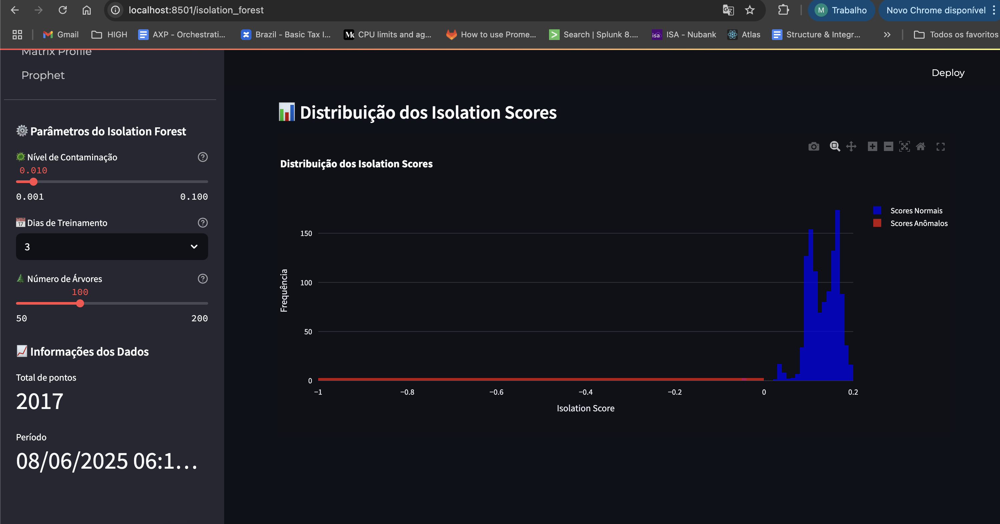
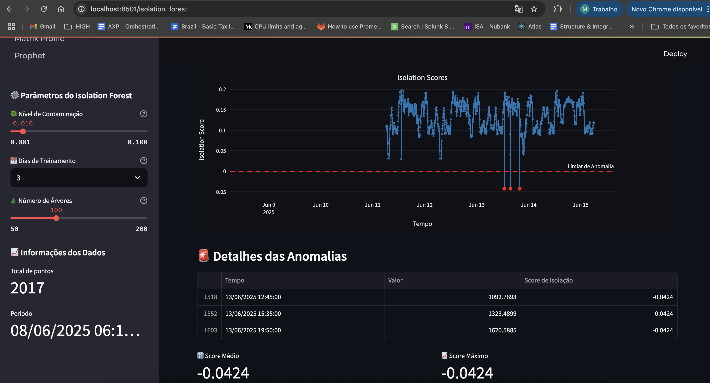

# 🔧 Requirements

- Python 3.10+
- Docker and Docker Compose
- Prometheus and Alertmanager (optional) configured


# 🚀 How to Run the Projects

Each project is independent and must be configured and run separately.


## 2️⃣ Streamlit Dashboard (Frontend)

### 2.1 Environment Variables Setup

Enter the project folder and copy the sample file:

```bash
cd streamlit-dashboard
cp .env.sample .env
```

Edit the `.env` file as needed:

```env
PROMETHEUS_URL=https://your-prometheus-url.example.com/select/0/prometheus/
```

---

### 2.2 Install Dependencies (Manual)

```bash
cd streamlit-dashboard
python3 -m venv .venv
source .venv/bin/activate
pip install -r requirements.txt
```

---

### 2.3 Running

#### a) Using Docker Compose

```bash
cp .env.sample .env
# Adjust the .env file
docker-compose up -d
```

#### b) Without Docker

```bash
cd streamlit-dashboard
streamlit run app.py
```

---

# 🧠 Features

## Streamlit Dashboard

- User-friendly interface for metric visualization
- Real-time anomaly visualization
- Anomaly detection using machine learning models
- Interactive anomaly visualization
- Configurable parameters via `.env`

---

**Note:**  
Each project has its own `Dockerfile` and `docker-compose.yml`.  
Always run `docker-compose up -d` inside the corresponding folder to start the services.

# 🖼️ Images





